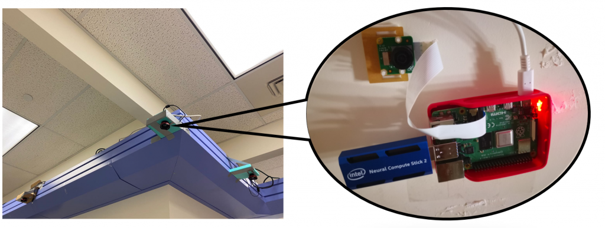

# Projects

<html>
	
</html>

Leg shaking is something all of us can relate to; when you or someone near you sits down and unconciously begins to shake his/her leg, the generated noise and vibrations causes a disturbance. Intuition says that this problem can be resolved using the smartphone's accelerometer combined with simple processing techniques, but show that if the smartphone is not directly located on the person's shaking leg, the accelerometer can measure patterns that look like other common movements. To solve this challenge, we develop a novel PCA-based filtering algorithm that retains only the fundamental frequencies of leg shaking and incorporate this method into a smartphone-based system that leverages user feedback to improve detection performance over time by personalizing our novel filtering method to the phone owner's unique leg shaking characteristics.
